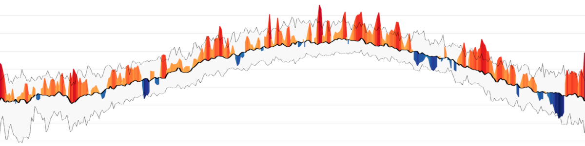

# MeteoHist - Historical Meteo Graphs

## A Streamlit app to create temperature and precipitation graphs for places around the world.

This app allows to create temperature and precipitation (rain, showers, and snowfall) graphs that compare the values of a given location in a given year to the values of a **reference period** at the same place.

The reference period **defaults to 1961-1990** which [according](https://public.wmo.int/en/media/news/it%E2%80%99s-warmer-average-what-average) to the World Meteorological Organization (WMO) is currently the **best "long-term climate change assessment"**. Other reference periods of 30 years each can be selected, too.

The **peaks** on the graph show how the displayed year's values deviate from the mean of the reference period. For temperature graphs, this means that the more and the higher the red peaks, the more "hotter days than usual" have been observed. The blue peaks indicate days colder than the historical mean. Precipitation graphs show blue peaks on top which means "more precipitation than normal" and in red "less than normal".

The plot is created using Python's **Matplotlib** library.

By default, mean values of the reference period are **smoothed** using Locally Weighted Scatterplot Smoothing (LOWESS). The value can be adjusted under "advanced settings" in the app.

### Data

To create the graph, data from the open-source weather API [**Open-Meteo**](https://open-meteo.com/en/docs/historical-weather-api) is used. According to them, "the Historical Weather API is based on **reanalysis datasets** and uses a **combination of weather station, aircraft, buoy, radar, and satellite observations** to create a comprehensive record of past weather conditions. These datasets are able to **fill in gaps by using mathematical models** to estimate the values of various weather variables. As a result, reanalysis datasets are able to provide detailed historical weather information for **locations that may not have had weather stations nearby**, such as rural areas or the open ocean."

The **Reanalysis Models** are based on [ERA5](https://cds.climate.copernicus.eu/cdsapp#!/dataset/reanalysis-era5-single-levels?tab=overview), [ERA5-Land](https://cds.climate.copernicus.eu/cdsapp#!/dataset/reanalysis-era5-land?tab=overview), and [CERRA](https://cds.climate.copernicus.eu/cdsapp#!/dataset/reanalysis-cerra-single-levels?tab=overview) from the [**European Union's Copernicus Programme**](https://www.copernicus.eu/en).

To get location data (lat/lon) for the input location, [**Openstreetmap's Nominatim**](https://nominatim.openstreetmap.org/) is used.

### Metrics

Available metrics are:

- **Mean Temperature:** Mean daily air temperature at 2 meters above ground (24 hour aggregation from hourly values)
- **Minimum Temperature:** Minimum daily air temperature at 2 meters above ground (24 hour aggregation from hourly values)
- **Maximum Temperature:** Maximum daily air temperature at 2 meters above ground (24 hour aggregation from hourly values)
- **Precipitation (Rolling Average):** 30-day rolling/moving average of the sum of daily precipitation (including rain, showers and snowfall)
- **Precipitation (Cumulated):** Cumulated sum of daily precipitation (including rain, showers, and snowfall)

### Settings

- **Location to display:** Name of the location you want to display. A search at Openstreetmap's Nominatim will be performed to find the location and get latitude and longitude.
- **Year to show:** Year to be compared to reference period.
- **Reference period:** The reference period is used to calculate the historical average of the daily values. The average is then used to compare the daily values of the selected year. 1961-1990 (default) is currently considered the best "long-term climate change assessment" by the World Meteorological Organization (WMO).
- **Peaks to be annotated:** Number of maximum peaks to be annotated (default: 1). If peaks are close together, the text might overlap. In this case, reduce the number of peaks.
- **Units:** Whether to use Metric System (°C, mm - default) or Imperial System (°F, In).
- **Smoothing:** Degree of smoothing to apply to the historical data. 0 means no smoothing. The higher the value, the more smoothing is applied. Smoothing is done using LOWESS (locally weighted scatterplot smoothing).
- **Peak method:** Method to determine the peaks. Either the difference to the historical mean (default) or the difference to the 95 percentile. The percentile method focuses more on extreme events, while the mean method focuses more on the difference to the historical average.
- **Emphasize peaks:** If checked, peaks that leave the gray area between the 5 and 95 percentile will be highlighted more.

### Examples

<p float="left">
  <a href="https://github.com/yotkadata/meteo_hist/blob/main/examples/duisburg-germany-temperature_max-2019_ref-1961-1990.png">
    
  </a>
  <a href="https://github.com/yotkadata/meteo_hist/blob/main/examples/bad-neuenahr-ahrweiler-germany-precipitation_rolling-2021_ref-1961-1990.png">
    
  </a>
  <a href="https://github.com/yotkadata/meteo_hist/blob/main/examples/addis-ababa-ethiopia-temperature_mean-2022_ref-1961-1990.png">
    
  </a>
  <a href="https://github.com/yotkadata/meteo_hist/blob/main/examples/atlantic-ocean-temperature_mean-2023_ref-1961-1990.png">
    
  </a>
  <a href="https://github.com/yotkadata/meteo_hist/blob/main/examples/key-west-united-states-temperature_max-2023_ref-1961-1990.png">
    
  </a>
  <a href="https://github.com/yotkadata/meteo_hist/blob/main/examples/mumbai-india-precipitation_cum-2022_ref-1961-1990.png">
    
  </a>
</p>

### License

The app and the plots it produces are published under a [**Creative Commons license (CC by-sa-nc 4.0)**](https://creativecommons.org/licenses/by-nc-sa/4.0/deed.en).

### Try it

You can try the app at [https://yotka.org/meteo-hist/](https://yotka.org/meteo-hist/)

To use the app on your machine, there are two simple ways:

**1. Set up a Python environment, clone the repository, and run app.py using streamlit:**

```bash
git clone https://github.com/yotkadata/meteo_hist/
cd meteo_hist/
pip install -r requirements.txt
streamlit run app.py
```

This should open a page in your default browser at http://localhost:8501 that shows the app.

**2. Set up Docker and run it in a container (you can change the name and the tag, of course):**

```bash
docker build -t meteo_hist:latest github.com/yotkadata/meteo_hist
docker run -d --name meteo_hist -p 8501:8501 meteo_hist:latest
```

Then open http://localhost:8501 or http://0.0.0.0:8501/ in your browser to see the app.

To save the generated files outside the Docker container, you can add a binding to a folder on your hard drive when you start the container:
(replace `/home/user/path/output/` with the path to the folder to be used).

```bash
docker run -d --name meteo_hist -p 8501:8501 -v /home/user/path/output/:/app/output meteo_hist:latest
```

### Thanks

- This app was inspired by [plots](https://twitter.com/dr_xeo/status/1656933695511511043) made by [Dr. Dominic Royé](https://github.com/dominicroye) - thanks for the idea and the exchange about it.
