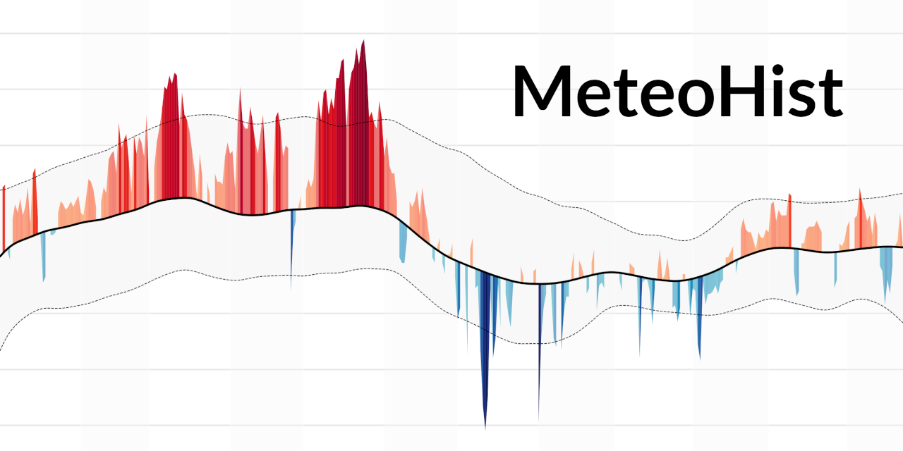

# MeteoHist - Historic Temperature Graph

### A streamlit app to create temperature graphs for places around the world.

This app allows to create temperature graphs that compare the **mean temperature** of a given location to the mean temperature of a **reference period**.

The reference period **defaults to 1961-1990** which [according](https://public.wmo.int/en/media/news/it%E2%80%99s-warmer-average-what-average) to the World Meteorological Organization (WMO) is currently the **best "long-term climate change assessment"**. Other reference periods of 30 years each can be selected, too.

The **peaks** on the graph show how the displayed year's temperatures deviate from the mean of the reference period. The more and the higher the red peaks, the more "hotter days than usual" have been observed. The blue peaks indicate days colder than the historic mean.

The map is created using Python's **Matplotlib** library.

#### Data

To create the graph, temperature data from the open-source weather API [**Open-Meteo**](https://open-meteo.com/en/docs/historical-weather-api) is used. According to them, "the Historical Weather API is based on **reanalysis datasets** and uses a **combination of weather station, aircraft, buoy, radar, and satellite observations** to create a comprehensive record of past weather conditions. These datasets are able to **fill in gaps by using mathematical models** to estimate the values of various weather variables. As a result, reanalysis datasets are able to provide detailed historical weather information for **locations that may not have had weather stations nearby**, such as rural areas or the open ocean."

To get location data (lat/lon) for the input location, [**Openstreetmap's Nominatim**](https://nominatim.openstreetmap.org/) is used.

#### License

The app and the maps it produces are published under a [**Creative Commons license (CC by-sa-nc 4.0)**](https://creativecommons.org/licenses/by-nc-sa/4.0/deed.en).

#### Try it

You can try the app at [https://yotka.org/meteo-hist/](https://yotka.org/meteo-hist/)

#### Thanks

- This app was inspired by [plots](https://twitter.com/dr_xeo/status/1656933695511511043) made by [Dr. Dominic Royé](https://github.com/dominicroye) - thanks for the idea and the exchange about it.
